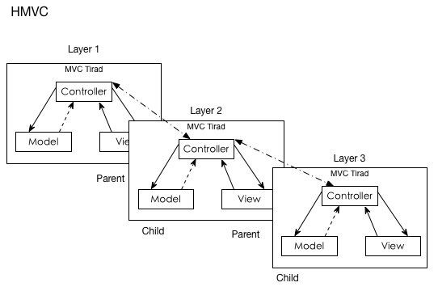

## 移动App架构设计

本文主要总结了几种常用的架构模式, 基本是层层递进的
转载请注名出处 [http://blog.csdn.net/uxyheaven](http://blog.csdn.net/uxyheaven/article/details/38041091), 良好的排版在[https://github.com/uxyheaven/](https://github.com/uxyheaven/NativeAppFrameworkDesign)阅读

如果觉得本文不错, 请在csdn给个顶, github给个star.

Native app的开发相比传统的项目迭代周期要短很多, 需求的变化也频繁一些, 在开发的不同生命周期里采用不同的架构模式可以有效的节约开发时间, 提高开发效率, 这篇文章先介绍几种常用的架构模式:

### 基本的MVC
移动app一般都是采用经典的mvc架构

| 层次 | 作用 | 设计原则 |
| ------------ | ------------- | ------------ |
| 模型层(model) | 封装了应用的一系列数据, 并定义了操作, 处理这些数据的逻辑和计算规则。  | 通过C：Notification,KVO对控制器进行反馈 |
| 视图层(view) | 视图对象是一个应用中, 用户可以看到的对象. 视图对象知道如何绘制自己, 也能够响应用户的操作. 视图对象的主要目的之一是将应用模型对象中的数据显示出来, 并允许用户编辑该数据 | 视图通过不能直接操作模型层, 通过target-action, delegate, dataSource和控制器进行反馈 |
| 控制器层(controller) | 控制器层是在视图层和若干个模型层的中间人  | c可以直接操作模型层和视图层 |

总结:
C对M：API
C对V：Outlet
V对C：Target-action， Delegate，Datasource
M对C：Notification，KVO

### MVC的改进版 MVVM
MVVM是在MVC的基础上多了一个View Model: 表示逻辑, 将 model 的数据转换为 view 可以呈现的东西. 适合大量展示类的App.

### HMVC
Hierarchical MVC, 是MVC包含⼦子MVC, 适合重型B/S架构的WebApp.

### 三层架构
我们在来看一下经典的三层架构

从上至下为

* 表示层(UI)
* 业务逻辑层或称为领域层(BLL)
* 数据访问层(DAL)

| 层次 | 作用 | 设计原则 |
| ------------ | ------------- | ------------ |
| 表示层(UI) | 向用户展现特定业务数据，采集用户的输入信息和操作  | 用户至上，兼顾简洁；不包含任何业务相关的逻辑处理 |
| 业务逻辑层(BLL) | 从ＤＡＬ中获取数据, 在ＵＩ显示; 从ＵＩ中获取用户指令和数据, 执行业务逻辑或通过ＤＡＬ写入数据源  | 作为U层与Ｄ层的桥梁,目的在于展现清晰的函数结构, 只负责数据处理传递, 不涉及ＳＱＬ语句和ＡＤＯ.ＮＥＴ |
| 数据访问层(DAL) | 直接操作数据库，针对数据的增添 删除 修改 查找; 具体为业务逻辑层或表示层提供数据服务。  | 专门操作数据库, 不考虑数据合法性. 数据库错误返回－1, 逻辑错误返回0, 并告知错误原因, 成功返回1 |

然后呢,我们现在的架构则是

### 四层架构

在三层架构的基础上多了业务规则层, 常的三层是把业务逻辑和业务规则合并为一个层，统称为业务层.业务规则层的提出,既可以及时处理用户输入的不合法信息, 又可以及时处理数据库错误, 增大了业务逻辑层的结构清晰度, 让业务逻辑人员专心致志做逻辑 

从上至下为

* 表示层
* 业务规则层
* 业务逻辑层或称为领域层
* 数据访问层

| 层次 | 作用 | 设计原则 |
| ------------ | ------------- | ------------ |
| 业务规则层(ECL) | 对于UI层传下来的参数来说，检查合法性。  | 用户至上，兼顾简洁；不包含任何业务相关的逻辑处理 |

### 五层架构
一般情况下, 我们的业务逻辑放在中间层, 那么对内部的这些大量种类繁多，使用方法也各异的不同的类的调用任务，就完全落到了表示层. 这样势必会增加表示层的代码量, 将表示层的任务复杂化, 和表示层只负责接受用户的输入并返回结果的任务不太相称, 并增加了层与层之间的耦合程度. 因此呢,我们需要增加接口去去统一的管理这些业务, 是设计模式中Facade模式的思想.

从上至下为

* 表示层
* 业务外观层
* 业务规则层
* 业务逻辑层或称为领域层
* 数据访问层

| 层次 | 作用 | 设计原则 |
| ------------ | ------------- | ------------ |
| 业务外观层 | 为负责子系统中的一组接口提供一个一致而且简单的接口。  |  |

### 新秀VIPER
viper这里不多说了,请想了解的自行搜索
